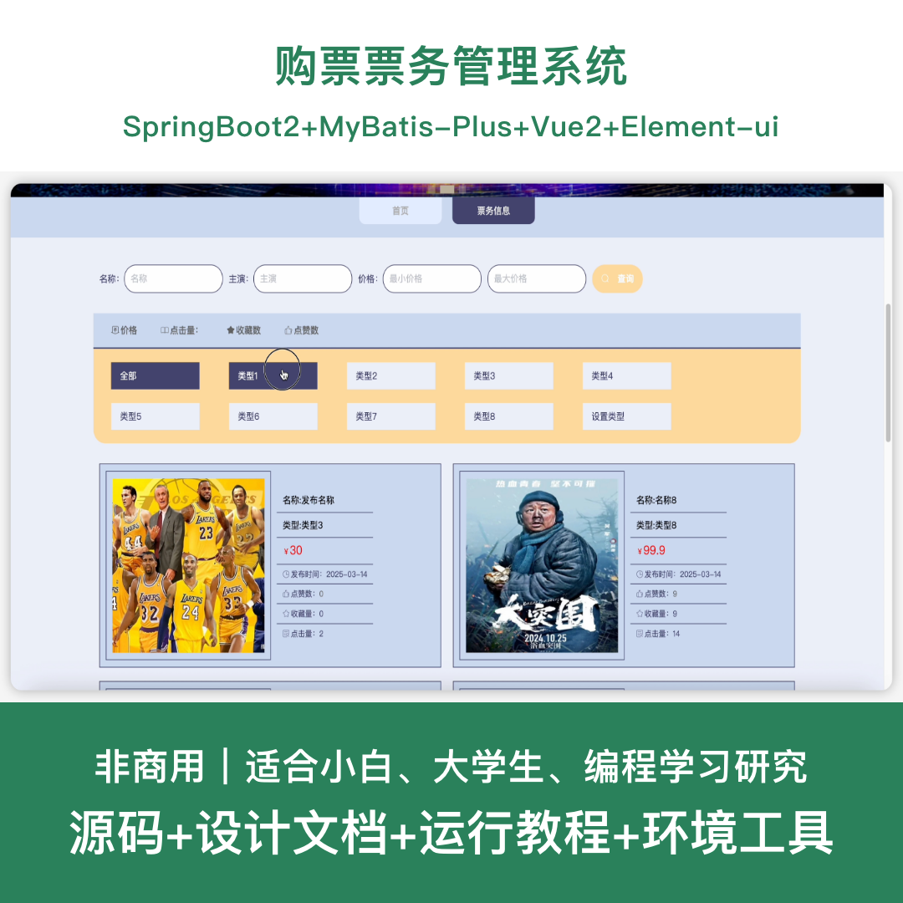
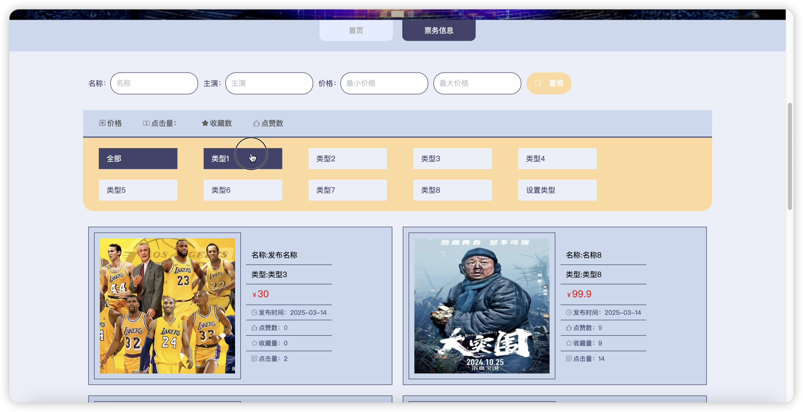
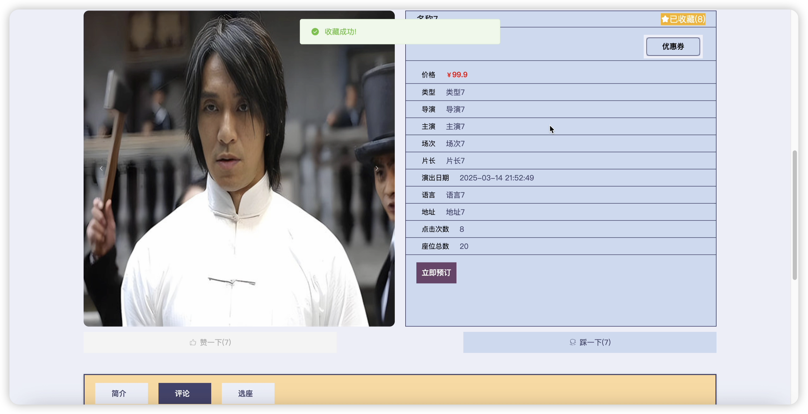
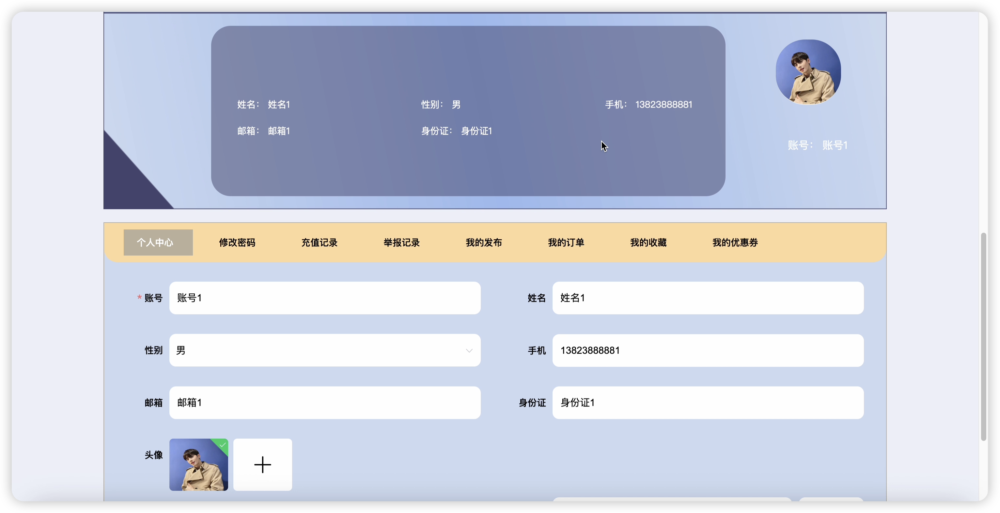
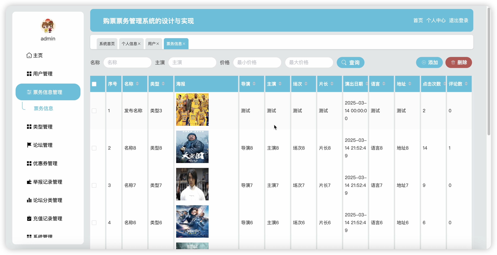
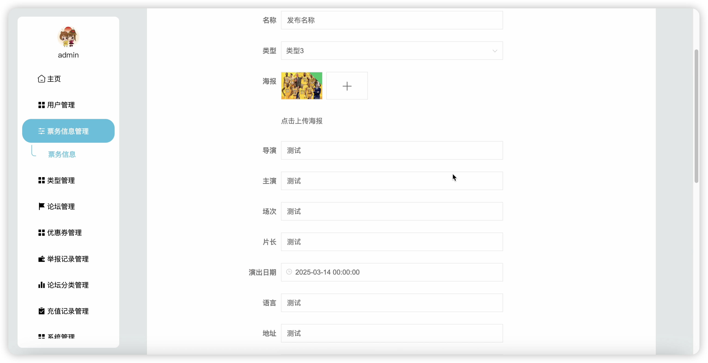
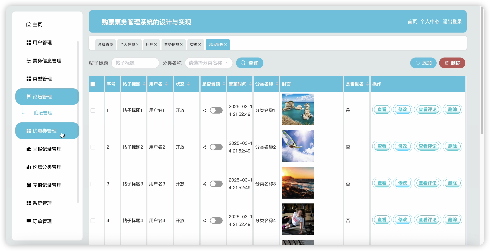
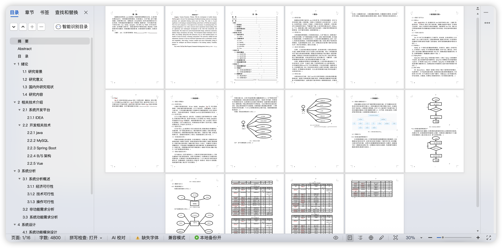

# springbootA546D
springbootA546D购票票务管理系统+LW
 
## 源码问题查看主页咨询

### 一、关键词
票务系统、购票系统、演出购票、售票系统、票务管理

### 二、作品包含
源码+数据库+设计文档+全套环境和工具资源+本地部署教程

### 三、项目技术
前端技术：Html、Css、Js、Vue2.6、Element-ui
后端技术：Java、SpringBoot2.2、MyBatis-Plus

### 四、运行环境（以下版本亲测，其他版本兼容性请自行测试）
开发工具：IDEA/eclipse + VSCODE

数据库：MySQL 5.7+

数据库管理工具：Navicat10以上版本

环境配置软件：JDK1.8 + Maven3.6+

前端Nodejs：14+

浏览器：谷歌浏览器

### 五、项目介绍
项目编号：springbootA546D

基于SpringBoot+Vue的购票票务管理系统，方便用户在线浏览和购买各类演出票务，提升票务管理效率和用户购票体验。

角色：管理员、用户

用户功能：注册登录、票务信息浏览、票务购买、订单管理、优惠券领取、论坛发帖、个人中心。

管理员功能：登录、用户管理、票务信息管理、订单管理、优惠券管理、论坛管理、公告管理、类型管理。

数据库表数量：17张

### 六、运行截图

